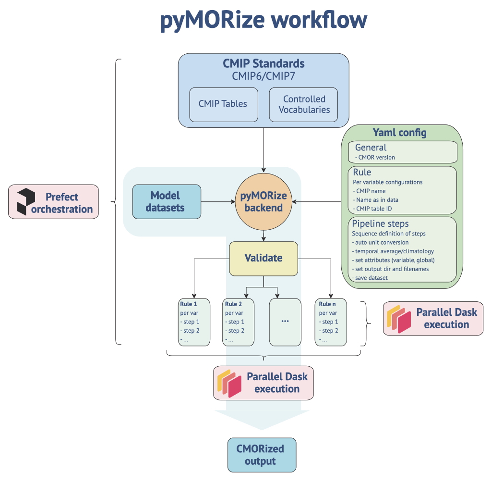

# Summary

PyMOR is a toolbox for preparing Earth System Model (ESM) data for analysis and
sharing with the community. PyMOR uses a simple command line interface and a
clear way to manipulate NetCDF files step by step to add relevant metadata,
transform units, combine variables, regrid, transform geometries, and more. It
runs in parallel using Dask and SLURM, and thus is suitable to handle even
large amounts of data. Written in Python, it allows users to quickly plug in
custom functionality outside of the core standard library, ensuring that the
toolbox can be extended to meet the exact needs of the user.

# Statement of need

Standardization of climate model outputs is crucial for preparing data for IPCC
reports because it ensures that results from different modeling centers worldwide
can be directly compared, combined, and analyzed in a consistent and transparent
manner. The IPCC and associated projects like CMIP require model outputs to be
formatted according to strict technical specifications: data must be provided
in standardized NetCDF files, using common variable names, units, metadata
conventions (such as the CF Metadata Conventions), and grid structures (e.g.,
rectilinear grids for most fields, standard pressure or depth levels for
vertical coordinates). This uniformity allows the Program for Climate Model
Diagnosis and Intercomparison (PCMDI) to centrally archive and distribute model
results, enabling hundreds of researchers to efficiently scrutinize, benchmark,
and synthesize findings across models and scenarios. Without such
standardization, the process of aggregating results for global assessments
would be error-prone, time-consuming, and potentially unreliable, undermining
the scientific basis for the IPCC’s policy-relevant conclusions.

While the benefit of standardization is clear, a non-inconsequential portion of
the climate modelling community prepares output files with native names, and
preparing data for comparison projects often requires post-processing after
the numerical simulations have been performed, rather than implementing the
proper naming conventions and metadata standards directly in the numerical
codes. Certain requested variables may need to be extracted from multiple output
files or computed from other variables, units may need to be converted, or
numerical geometry may need to be considered. Additionally, newer simulations
are producing considerably larger datasets than previous generations, which can
make it challenging to manipulate the files to conform to the requisite metadata
standards and best-practices.

We developed `pymor` to fill the need for a flexible, performant, extensible
post-processing toolbox for Earth System Model data. Built on top of `xarray`,
and `dask`, `pymor` provides a community-driven library of common
transformations, as well as a simple extension system. We were primarily
motivated to fill the following gaols:

* Metadata, variable naming, and unit conversion to the standards developed by
the CMIP community should work "out-of-the-box".
* first-class support for extension of the library to include custom user steps
* easy integration with other Python software
* ability to handle big data
* ability to run in parallel
* open source and community driven

# Overview of functionality



The functionality of `PyMOR` covers several key areas: accessing PCMDI standard
name tables, metadata management, and data transformation. To specify this, the
users create a specification file in YAML format, which describes the desired
output files as well as processing steps to apply to the inputs.

**PCMDI Standard Name Tables** are specified via the following entries in the
user yaml:

```yaml
general:
  cmor_version: "CMIP6"
  mip: "CMIP"
  CV_Dir: "..."
  CMIP_Tables_Dir: "..."
```

internall, `pymor` then extracts and understands the metadata to attach to the
simulation output files such as standard and long variable names, units,
institutional attributes, experiment metadata, and more.

**Flexible Mapping of Variables** allows the user to customize which variables
in which NetCDF files correspond to which variables in the PCMDI standard name.
As an example, we consider the variable `sst` (sea surface temperature), which
in the example model ouput is natively named `tos` (temperature of ocean surface).

The following mapping would be needed in the user yaml to map these variables to
each other:

```yaml
rules:
  - name: Conversion for SST
    description: "Here is some text for humans. It isn't used anywhere."
    inputs:
      - path: <path/to/an/output/directory>
        pattern: <some_regex_pattern>
    cmor_variable: sst
    model_variable: tos
```

**Data handling via the Pydata Ecosystem** allows the user to easily access the
NetCDF files in a familiar format (`xarray`) to perform custom manipulations.
Any processing step in a pipeline is expressed as a Python function with the
following signature:

```python
import pymor
from typing import Any

def my_custom_step(data: Any, rule: pymor.core.rule.Rule) -> Any:
    """
    A custom pipeline step

    Parameters
    ----------
    data : Any
        While ``data`` is formally ``Any``, typically it will be either
        a ``xarray.Dataset`` or ``xarray.DataArray`` object.

    rule : pymor.core.rule.Rule
        You additionally must have the parameter ``rule``, which contains the
        user-specified description that applies to this data, such as name of
        the variable in cmor, name in native terminology, source identification,
        model name, experiment, and so on.

    Returns
    -------
    Any
        The return value of this step is used further down the pipeline.
        Typically you want to pass back the (somehow transformed) ``data``.
    """
    ... # do some manipulation with data
    return data
```

**A robust standard library** of data transformations allows for common and
tested ways to manipulate data, including:

* unit conversion
* temporal averaging and resampling
* regridding and spatial averaging
* metadata attributes on both the file and variable level in output NetCDFs
* variable renaming
* axis, coordinate, and bounds renaming, sorting, and reordering

**Specialized pipelines** for each conversion allows the user to specify exactly
which manipulations should be applied to which files. In the `rules` section of
the yaml file the user specifies which pipelines should be applied to the data
loaded from the input section. Continuing the example from above:

```yaml
rules:
  - name: Conversion for SST
    description: "Here is some text for humans. It isn't used anywhere."
    inputs:
      - path: <path/to/an/output/directory>
        pattern: <some_regex_pattern>
    cmor_variable: sst
    model_variable: tos
    pipelines:
        - my_named_pipeline
        - another_pipeline
```
Data will thus pass first through the `my_named_pipeline` and then through
`another_pipeline`. Each of those needs to be defined as well, which is done in
a separate section of the `yaml` file:

```yaml
pipelines:
  - name: my_named_pipeline
    steps:
      - "pymor.core.gather_inputs.load_mfdataset"
      - "pymor.std_lib.convert_units"
      - "pymor.std_lib.time_average"
      - "pymor.std_lib.set_global_attributes"
  - name: another_pipeline
    steps:
      - "pymor.std_lib.trigger_compute"
      - "pymor.std_lib.show_data"
      - "pymor.std_lib.files.save_dataset"
```
For this example, we have just split the default pipeline into two ajoining
parts. If a `rule` specification does not have any `pipelines` defined, the
build-in `default` is used.

**Inclusion of custom steps** allows users to easily include their own functions
to further manipulate data. First, a suitable Python function should be written:

```python
import xarray as xr
from pymor.core.rule import Rule

# Note that type hints are encouraged (but not enforced) by PyMOR
def add_pp_components(data: xr.Dataset, rule: Rule) -> xr.DataArray:
    """Adds together Net Primary Production components"""
    # In this example, we utilize two different input variable in the native
    # model outputs with cryptic names to construct a well-known standard name
    # for the Net Primary Production (NPP) variable.
    data["pp"] = data["diags3d01"] + data["diags3d02"]
    # This return is mandatory for the pipeline to usefully continue
    # We return our new variable to be further processed:
    return data["pp"]  # Return type: DataArray.
```

Then, the user adds the path to the file containing this function to their
pipeline definition:

```yaml
pipelines:
  - name: convert_with_pp
    steps:
      - "pymor.core.gather_inputs.load_mfdataset"
      - "script://./intpp_recom.py:add_pp_components"
      - "pymor.fesom_1p4.nodes_to_levels"
      - "script://./intpp_recom.py:vertical_integration"
      - "script://./intpp_recom.py:set_pp_units"
      - "pymor.std_lib.convert_units"
      - "pymor.std_lib.time_average"
      - "pymor.std_lib.set_global_attributes"
      - "pymor.std_lib.trigger_compute"
      - "pymor.std_lib.show_data"
      - "pymor.std_lib.files.save_dataset"
```

The special tag `script://` followed by an absolute path to a Python file and
the function name separated by a colon allows user-defined functionality, as:

```yaml
pipelines:
   - name: <some_name>
     steps:
        - "script://<path/to/some/script.py>:<function_name>"
```

**Parallelization and scalability** is achieved by using
[`dask`](https://dask.org/) and
[`dask-jobqueue`](https://jobqueue.dask.org/en/latest/) to distribute the
workload in a High Performance Computing (HPC) environment, typically in such a
way that the users can run post-processing pipelines on the same machine that
they produced the simulations with. Simple usage of dask is enabled directly in
the user configuration file:

```yaml
pymor:
  parallel: True
  dask_cluster: "slurm"
  dask_cluster_scaling_mode: fixed
  fixed_jobs: 12
```

**Simple command line usage** enables launching all conversion
functionality once the user has defined the configuration file:

```bash
$ pymor process <path/to/config.yaml>
```

Once launched, simple monitoring is available to examine both the Dask
processing, as well as the conversion of individual pipelines, which are
optionally orchestrated via [`prefect`](https://prefect.io/). When using an
orchestrator, the user also has options to cache intermediate results, thus
enabling only partial processing of the conversion if the process needs to be
restarted for whatever reason.

# Acknowledgements

We acknowledge valuable contributions from Christopher Danek and
Christian Stepanek for early design testing, as well as the CMIP team for
fruitful discussions and feedback.

# References

- - - - -

Everything below this part is purely information and writing guidelines for the
co-authors.

# Citations

Citations to entries in paper.bib should be in
[rMarkdown](http://rmarkdown.rstudio.com/authoring_bibliographies_and_citations.html)
format.

If you want to cite a software repository URL (e.g. something on GitHub without a preferred
citation) then you can do it with the example BibTeX entry below for @fidgit.

For a quick reference, the following citation commands can be used:
- `@author:2001`  ->  "Author et al. (2001)"
- `[@author:2001]` -> "(Author et al., 2001)"
- `[@author1:2001; @author2:2001]` -> "(Author1 et al., 2001; Author2 et al., 2002)"

# Figures

Figures can be included like this:

and referenced from text using \autoref{fig:example}.

Figure sizes can be customized by adding an optional second parameter:
{ width=20% }
